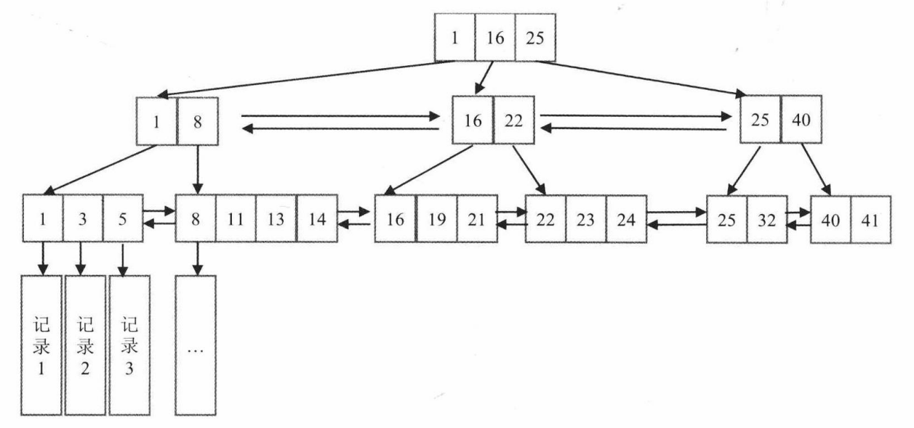
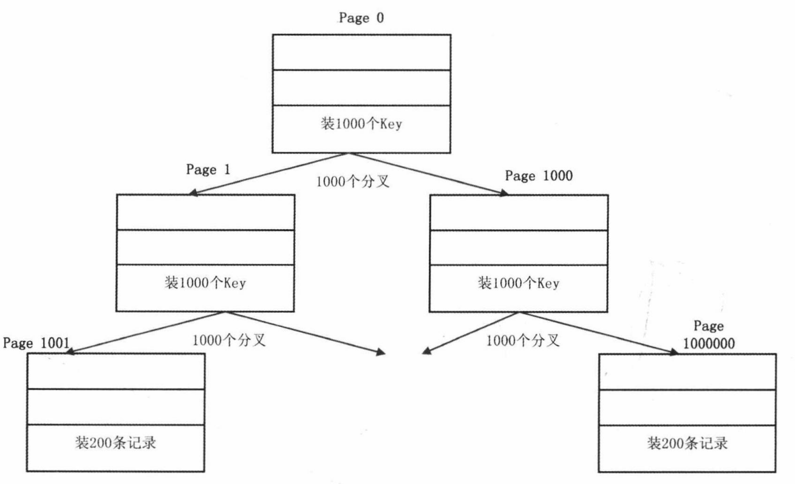
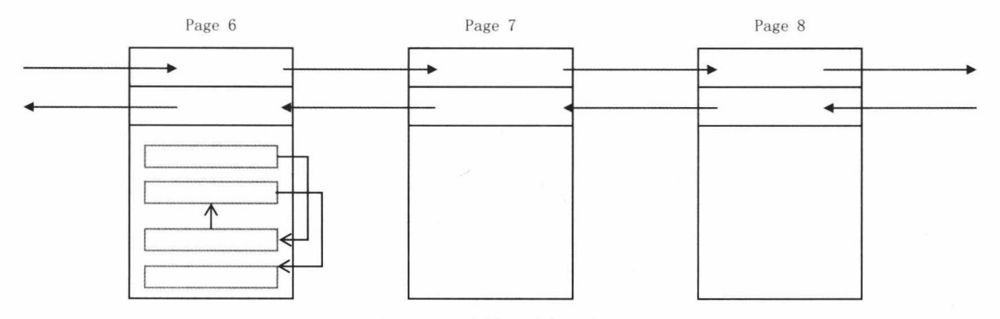

# 索引介绍

索引是一种排好序的数据结构

# B+树

## B+树的逻辑结构

- 在叶子节点一层，所有记录的主键按照大小顺序排列，并且形成一个双向链表。叶子节点每个key都指向一条记录。
- 非叶子节点取的是叶子节点里面key的最小值。同一层非叶子节点相互串联，也形成一个双向链表。

## B+树的物理结构

以InnoDB引擎为例，对于磁盘来说，不可能一条一条的读写，而都是以‘块‘为单位进行读写。InnoDB默认块的大小为16KB,通过innodb_page_size参数指定。

- 第一层：一个节点是一个Page，里面存放了1000个key,对应1000个叶子节点。
- 第二层：1000个节点，1000个Page,每个Page里面装1000个key。
- 第三层：1000*1000个节点，每个Page里装200条记录，及是1000*1000*200=2亿条记录

Page和Page之间组成双向链表，每个Page头部有两个关键字段：前一个Page的编号，后一个Page的编号。Page里面存储一条条记录，记录之间用单向链表串联。

# 主键索引

表的主键列就是使用的主键索引

# 二级索引

二级索引叶子节点存储的数据是主键的值，需根据主键再回表查询数据

# 聚簇索引和非聚簇索引

聚簇索引及索引结构和数据一起存放的索引，如：主键索引

非聚簇索引及索引结构和数据分开存放的索引，如：二级索引

# 覆盖索引和联合索引

覆盖索引：一个索引包含所有要查询的字段的值，称为覆盖索引

联合索引：使用表的多个字段创建索引

## 最左前缀匹配原则

最左前缀匹配原则指的是在使用联合索引时，MySQL 会根据索引中的字段顺序，从左到右依次匹配查询条件中的字段。

最左匹配原则会一直向右匹配，直到遇到范围查询（如 >、<）为止。对于 >=、<=、BETWEEN 以及前缀匹配 LIKE 的范围查询，不会停止匹配。

# 避免索引失效

索引失效也是慢查询的主要原因之一，常见的导致索引失效的情况

- 未遵守最左匹配原则
- 在索引列上进行计算，函数，类型转化等操作
- OR 的前后条件中有一个列没有索引，涉及的索引都不会被使用到
- IN 的取值范围较大（NOT IN 与 IN 失效场景相同）
- 以%开头的LIKE查询，如 LIKE '%abc'
- 发生隐式转换

